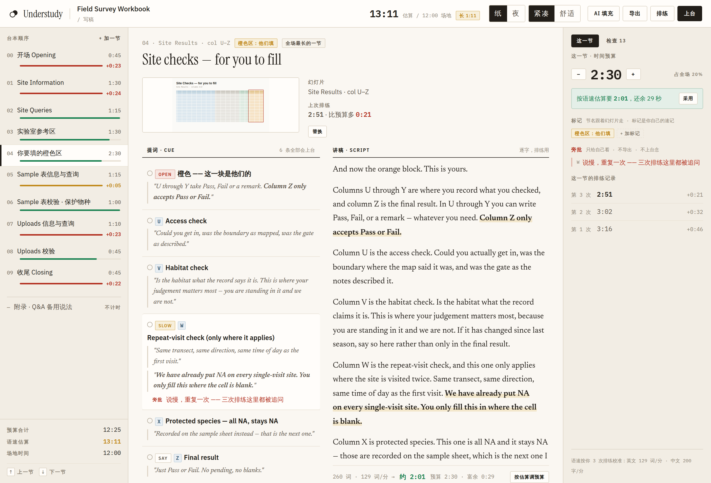
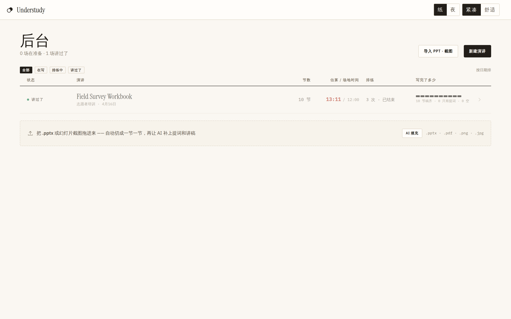
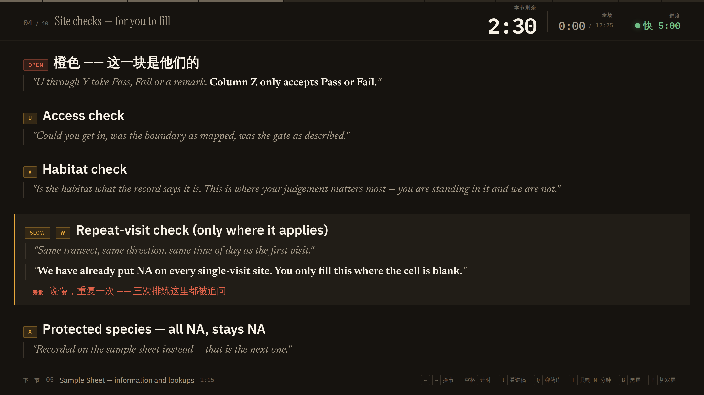
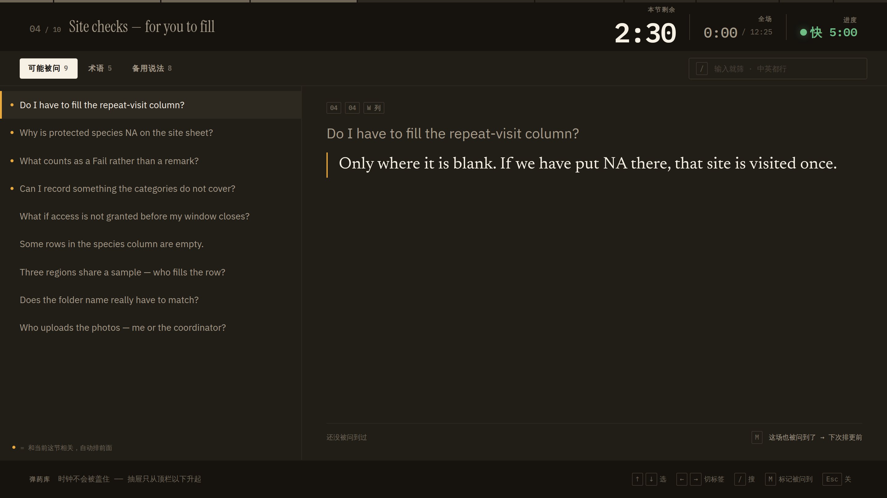
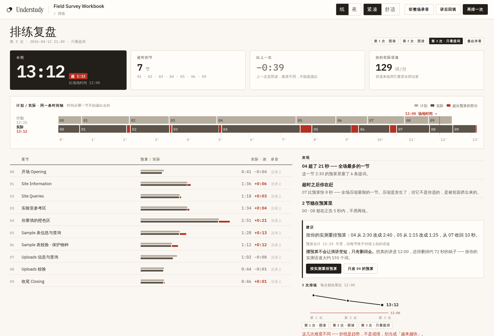
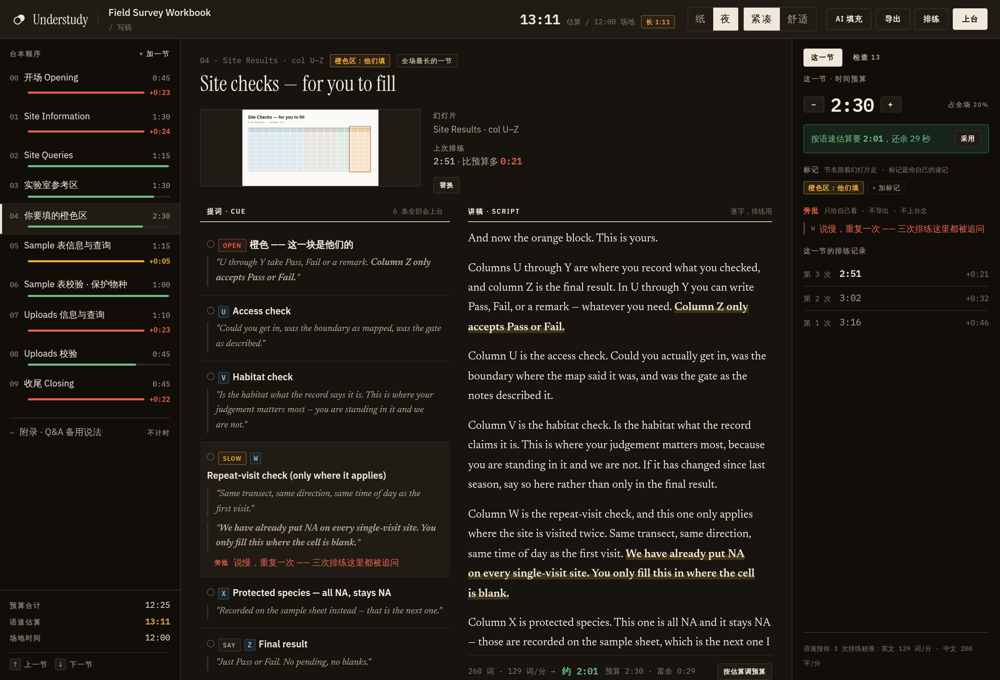

# Understudy

**替补演员。** 帮你把演讲稿写完、排练到位、上台不慌 —— 一个自包含的 HTML 文件，
双击就能用，没有服务端、没有安装、没有账号。

上台那台电脑可能没网、可能不是你的。所以产品就是一个文件：把它拷进 U 盘、附在邮件里、
放进桌面，打开就是你的台本。**字体也在里面** —— 断网打开，看到的仍然是你排练时的那一版，
而不是一堆后备字。代价是 900 KB 出头，值得。



---

## 它解决什么

写演讲稿的人都知道两件事会出问题：**讲不完**，和**讲到一半忘了下一句**。
Understudy 只围绕这两件事。

- **提词与讲稿分两层。** 讲稿是逐字的，用来排练和记忆；提词是要点，上台只看它。
  两层同时可见地写，上台时只留一层。
- **旁批。** 用你的母语写给自己的表演提示 —— 哪里说慢、哪里容易被追问、上次在哪讲错。
  **不导出、不打印、上台也不会念出来。** 它是这个工具最独特的一层。
- **写的时候就知道讲不讲得完。** 按字数和你的语速估算每一节要多久，和你给它的预算对比。
  语速不是拍的，是从你历次排练实测反推的。
- **上台时不会丢失时间感。** 本节剩余、全场、以及"你比计划快/慢多少" —— 最后一个只在
  换节时重算，所以讲的过程中数字不会跳。

## 界面

| | |
|---|---|
| **后台** 一眼看到讲不讲得完、练了几次 |  |
| **提词卡** 台下是暗的，所以它是暖黑的；全场唯一鲜艳的东西是配速信号 |  |
| **弹药库** `Q` 升起。可能被问 / 术语 / 备用说法三个标签共用一个入口，而且**时钟永远不被盖住** |  |
| **排练复盘** 重点不是"你超了 1 分 12 秒"，是"时间从第 04 节开始漏" |  |

写稿的界面有两个开关，都是纯粹的令牌替换 —— 布局逐像素一致：

**纸 / 夜**（晚上写稿护眼）· **紧凑 / 舒适**（舒适模式一屏少看约五分之一，换来更松的呼吸）



## 上台的按键

| 键 | |
|---|---|
| `← →` | 换节 |
| `空格` | 起 / 停计时 |
| `↓` | 看讲稿，直接定在你大概讲到的那一句（`↑↓` 微调） |
| `Q` | 弹药库 |
| `T` | 只剩 N 分钟 —— 按重要度重排剩下的节，并说明跳过一节会漏掉什么 |
| `B` | 黑屏 |
| `P` | 切双屏演讲者视图 |
| `Esc` | 退出当前层 |

每个绑定的键都必须能被底栏打印出来 —— 这条规则写进了代码里，"绑了但没印"在结构上
不可能发生。

## 隐私

- **所有内容都在你的浏览器里。** 没有服务端可以上传到。
- **录音存在本机**，按节切分，不上传。
- **转写默认关闭**，因为它要把音频送去第三方 —— 界面上直接这么写，不埋进设置里。
- 导出的副本是这个应用本身加上你的台本，仍然是一个自包含的文件。

## 用

下载 [`dist/understudy.html`](dist/understudy.html)，双击。
或者打开 [在线版](https://tongwu.github.io/understudy/)（内置一份合成的样例演讲）。

导入你自己的：把幻灯片导成图片拖进来，一张一节；或者用 **AI 填充** —— 它生成一段
指令，你拿去任意一个 AI 里跑，把结果粘回来校验。那段指令以后接 API 时就是 system
prompt，所以现在调好它不白费。

## 开发

```sh
npm install
npm run build        # viewer/ → dist/understudy.html
npm test             # 单测 + 端到端（playwright 驱动真实产物）
node tools/make_sample.mjs   # 重新生成内置样例
node tools/shots.mjs         # 重新生成上面的截图
```

编号即加载顺序：`viewer/js/NN-*.js` 可以用编号比自己小的一切，不能用比自己大的。
模块间的共享契约在 [`docs/planning/CONTRACT.md`](docs/planning/CONTRACT.md)，
产品决策在 [`DESIGN.md`](DESIGN.md)。

内置的样例演讲（一份志愿者田野调查手册的讲解）是**编的** —— 见
`tools/make_sample.mjs` 的文件头。构建产物会被发布到 GitHub Pages，所以样例内容
无论仓库是否公开都是公开的。

## 还没做

- **PPTX 不解析**，先把每页导成图片。
- **只读分享视图**（给别人看的干净台本）还没做。

## License

MIT
